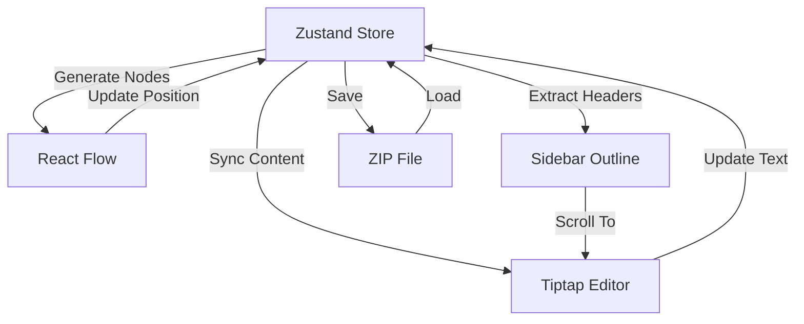

# iEditWeb システム設計書

## 1. アーキテクチャ概要
本アプリケーションは、サーバーレスで動作するクライアントサイド完結型のSPA (Single Page Application) / PWA (Progressive Web App) です。

### 技術スタック
- **フレームワーク**: React 18 + TypeScript
- **ビルドツール**: Vite + `vite-plugin-singlefile` (単一HTML出力)
- **UIライブラリ**: Tailwind CSS + shadcn/ui
- **状態管理**: Zustand
- **エディタエンジン**: Tiptap (Markdownベース)
- **フローチャートエンジン**: React Flow
- **アイコン**: Lucide React
- **永続化・ファイル操作**: JSZip, file-saver, IndexedDB

## 2. データフロー設計
アプリケーションの状態（State）は `Zustand` ストアで一元管理し、各ビューと同期します。

## 3. ファイルフォーマット (.zip)
保存データはZIP形式で圧縮され、以下の構造を持ちます。

- `content.md`: テキストデータ（Markdown形式）
- `metadata.json`: アプリケーション固有データ
    - フローチャートのノード座標 (x, y)
    - ノードの色・スタイル設定
    - エディタのカーソル位置、スクロール位置
- `assets/`: 画像ファイル格納フォルダ

## 4. 開発・運用フロー
- **開発**: `npm run build` でビルドし、生成された `dist/index.html` をブラウザで開いて確認。
- **配布**: `index.html` 単体を配布、またはPWAとしてインストール。
